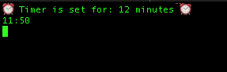

# CountDown
Terminal based Countdown written in python

## Dependencies

* [Emoji](https://pypi.org/project/emoji/)

## Features

- [X] Count down threshold to 60mins
- [X] Count down threshold to 24hrs
- [X] Count down threshold support only seconds
- [ ] Maybe give this a GUI??
